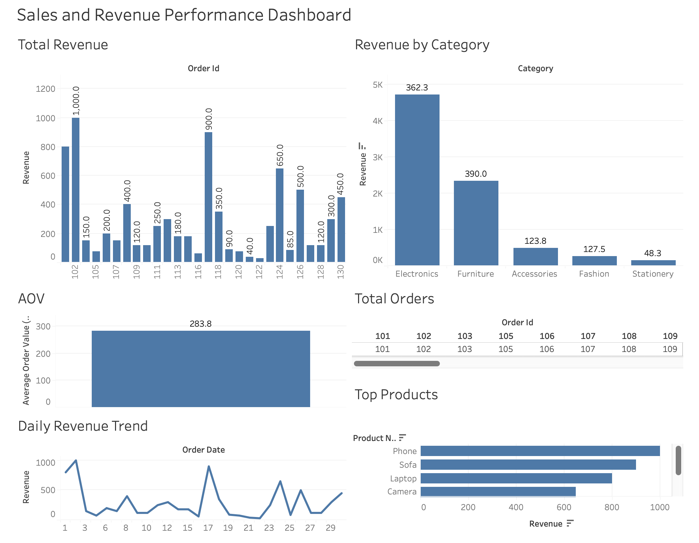
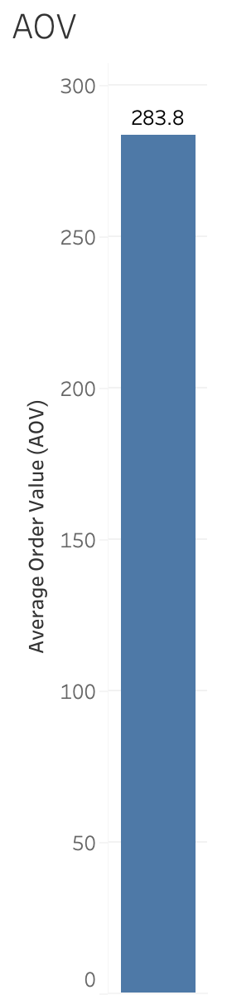
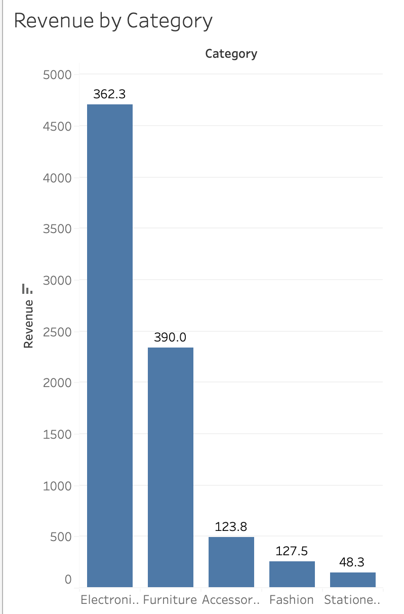

# Sales & Revenue Dashboard

## Description
A dashboard showing sales performance using SQL, Python, and Tableau. Tracks total revenue, orders, average order value, top products, and daily revenue trends.

## Technologies
- SQL (MySQL): Schema design, data insertion, and analytical queries
- Python: Export data to CSV for Tableau
- Tableau: Dashboard visualization

## Folder Structure

sales_dashboard_project/
│
├── sql/
│   ├── schema.sql
│   ├── insert_data.sql
│   └── analysis_queries.sql
│
├── python/
│   └── export_data.py
│
├── data/
│   └── sales_analysis_clean.csv
│
├── tableau/
│   └── dashboard.twb
│
├── screenshots/
│   ├── dashboard_screenshot.png
│   ├── KPI_section.png
│   └── revenue_by_category.png
│
└── README.md

## How to Run

1. **Set up the database**  
   - Open MySQL and execute `sql/schema.sql` to create the tables.  
   - Execute `sql/insert_data.sql` to insert the sample data.  

2. **Export data for Tableau**  
   - Run `python/export_data.py` to generate `data/sales_analysis_clean.csv`.  
   - This script fetches data from MySQL (or the `sales_analysis_view`) and prepares it for Tableau.  

3. **Open Tableau dashboard**  
   - Open `tableau/dashboard.twb` in Tableau.  
   - Connect it to `sales_analysis_clean.csv` to visualize KPIs, charts, and trends.

## 📊 Key Insights

- Total Orders and Total Revenue provide a quick overview of sales performance.
- Electronics category contributes the highest revenue.
- Daily revenue trend shows how sales fluctuate over time.
- Repeat customers indicate potential customer retention and loyalty.

## 📸 Dashboard Screenshots

### Dashboard Overview

### Key KPIs

### Revenue by Category

Note: This is a demo project with sample data for portfolio purposes. All data is fictitious.
